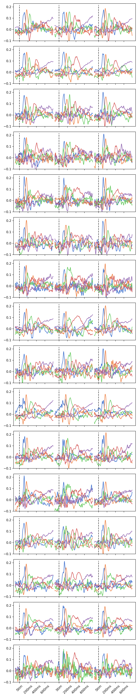
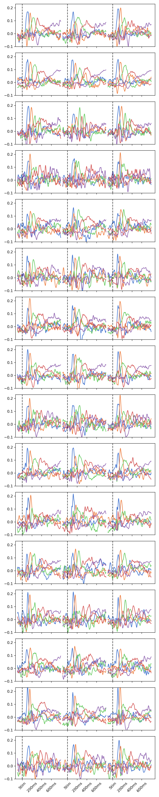

# Coupled Generator Decomposition for Fusion of Electro- and Magnetoencephalography Data

*This paper has been accepted to be presented at EUSIPCO2024 (paper #1133) at session TH2.PA2 (poster 8)*

This repository contains the implementation of the Coupled Generator Decomposition (CGD) model, which could used for multisubject, multimodal, or multigroup modeling. The model introduced here extends sparse principal component analysis (SPCA) for data fusion, enabling the identification of common features across diverse data sources while accommodating modality- and subject-specific variability. The model also includes archetypal analysis and [directional archetypal analysis](https://www.frontiersin.org/journals/neuroscience/articles/10.3389/fnins.2022.911034/full). Please cite the Following paper if you use this repository in your own work:

[_Coupled generator decomposition for fusion of electro- and magnetoencephalography data_, AS Olsen, JD Nielsen, M Mørup (arXiv, 2024)](https://arxiv.org/abs/2403.15409)

## Introduction

Say you have a data matrix $\mathbf{X}$ $_s$ of size $(N_s\times P)$, where $s$ indicates the index for, e.g., a subject, clinical group, or data modality. In our paper, $N_{\textrm{EEG}}=70$ and $N_{\textrm{MEG}}=102$ are the number of sensors for each neuroimaging modality and $P=180$ is the number of time-points in a face perception experiment. Say, next, that you wish to conduct some form of matrix decomposition to identify sources and source mixing matrices --- using, e.g., princpal/independent component analysis or archetypal analysis. In our paper, Naturally, one would concatenate data matrices such that $N=\sum_s N_s$, however, this approach would lead to a source mixing matrix that is shared across the groups. In our paper, this would mean that the time-courses for the inferred sources are assumed equal since the two modalities are sensitive to different types of brain activity, an assumption that is not likely to hold in practice. Likewise, if the same experiment was repeated over subjects, assuming that sources are mixed equally for all subjects is likely too restrictive. 

Here we present a conceptual framework and PyTorch toolbox for data fusion using sparse principal component analysis. In short, we require that at least *one* dimension is sampled equally across data groups (in the above case, the time axis was equal between the modalities and subjects). Along the shared dimension, a sparse source identifier matrix $\mathbf G$ of size $(P\times K)$, where $K$ is the number of components, pinpoints the indices of the shared dimension that sources $\mathbf{XG}$ are built from. Importantly, $\mathbf G$ is *shared* across data groups. The mixing matrix $\mathbf S$ of size (P\times N_s) is then specific for each data group. 

## Toolbox

The main Python class `CGD.py` implements the Coupled Generator Decomposition model for a variable number of input data dimensions. 

### Requirements
- PyTorch

### Input data format

The input data `X` may either be a torch tensor of size (*,N,P), where * may be any number of extra dimensions (e.g., subjects, clinical groups, modalities provided). In the case that N differs across data groups, the input may be a *dictionary of torch tensors*.

- Example 1: A time-locked EEG experiment is repeated across $S$ subjects using the same number of EEG sensors $N$ and time points $P$: `X` is a torch.tensor(), and `X.shape = (S,N,P)`.
- Example 2: A time-locked simultaneous multimodal EEG and MEG experiment is repeated across $S$ subjects, but the number of EEG and MEG sensors is different: `X={'EEG':EEGdata,'MEG':MEGdata}` is a dictionary of torch tensors, where, e.g., `EEGdata.shape = (S,N_EEG,P)`. There are no restrictions on the naming or number of dictionary elements.

- **Required inputs:**
    - `num_comp`: the number of components to learn
    - `X`: a torch tensor or dictionary of torch tensors.
- **Optional inputs:**
    - `model`: the model to use. Options are 'SPCA', 'AA', 'DAA'. Default is 'SPCA'.
    - `Xtilde`: a torch tensor or dictionary of torch tensors to construct sources from, e.g., only the post-stimulus part of a time-locked experiment. If not specified, `Xtilde` is assumed to be equal to `X`.
    - `G_idx`: a boolean tensor of size `(P,)` indicating indices of a subset of `X` to construct sources from (defaults to all).
    - `lambda1`: the L1 regularization parameter for SPCA.
    - `lambda2`: the L2 regularization parameter for SPCA.
    - `init`: a dictionary of torch tensors, specifying the initial values for G (and S, if model=='AA').

### Supported Models

- **SpPCA**: Sparse Principal Component Analysis, in which L1 and L2 regularization coefficients must be provided. For sparse PCA, the model optimizes a shared generator matrix G `(P,K)` and a mixing matrix S `(*,K,P)` is inferred using a procrustes transformation through `(X.T@Xtilde)@G`.
- **AA**: Archetypal Analysis, in which the model optimizes a shared generator matrix G `(P,K)` and a mixing matrix S `(*,K,P)`. Both G and S are assumed non-negative and sum-to-one constraints enforced through the softmax function. 
- **DAA**: Directional Archetypal Analysis, which works similarly to AA except the data are assumed to be on a sign-invariant hypersphere.

## Author

- **Anders S Olsen**
- **Affiliation:** DTU Compute
- **Year:** 2023-2024
- **Latest toolbox update:** August 2024

## Distribution of S matrix over subjects referred to in paper (EEG left, MEG right)

    
    

